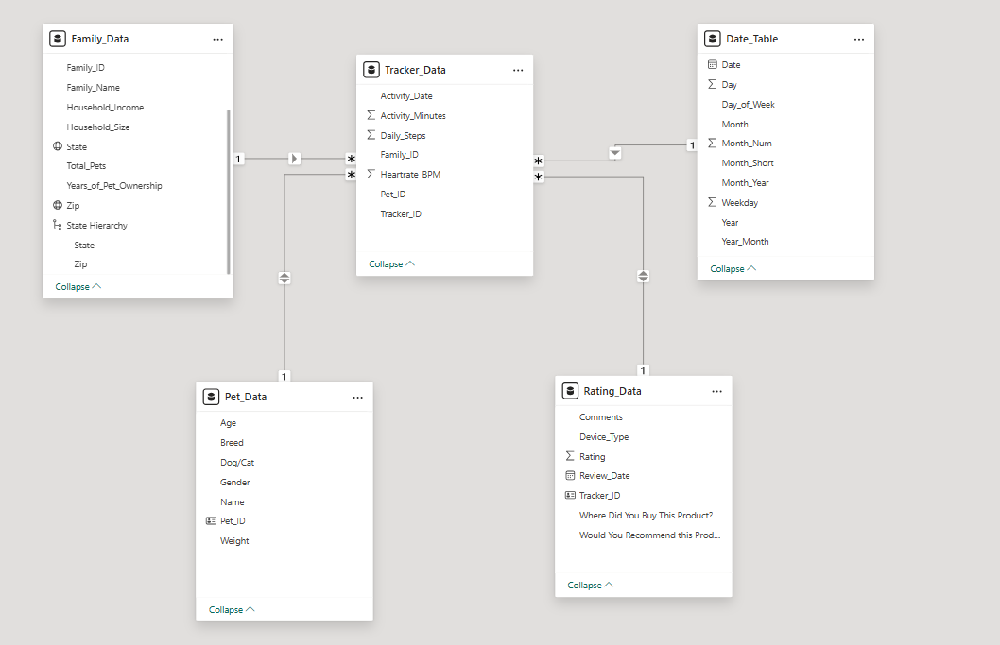
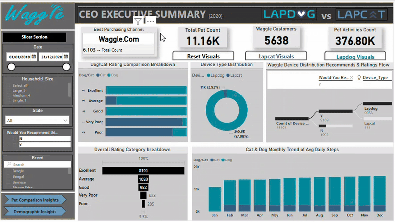

# Building a PowerBI Report for Waggle

## Waggle Pet Device Company: Comparitive Performance of Lapdog and Lapcat Smart device


- [My Role](#my-role)
- [Project Overvies](#project-overview)
- [Problem Statement](#problem-statement)
- [Stakeholder Engagement](#stakeholder-engagement)
  - [Target stakeholder](#target-stakeholder)
  - [Use Cases](#use-cases)
  - [Stakeholder Stories](#stakeholder-stories)
  - [Acceptance-Criteria](#acceptance-criteria)
  - [Success Criteria](#success-criteria)
- [Data Source](#data-source)
  - [Dataset](#dataset)
  - [Data model stucture](#data-model-structure)
- [Methodolody](#methodology)
  - [Tool Used](#tool-used)
  - [Development](#development)
    - [Project Planning & Requirement gathering](#project-planning--requirement-gathering)
    - [Data Exploration & Profiling](#data-exploration--profiling)
    - [ETL Process Using Power Query and Data modeling](#etl-process-using-power-query-and-data-modeling)
    - [Measures Developmenr Using DAX](#measures-development-using-dax)
    - [Dashboard Design & Visualisation](#dashboard-design--visualisation)
    - [Plushing and Collaboration](#publishing-and-collaboration)
    - [Documentation & Version control](#documentation--version-control)
    - [Review & Iteration](#review--iteration)
- [Detailed Insights and Recommendation](#detailed-insights-and-recommendations)
  - [CEO Executive Summary](#ceo-executive-summary)
  - [Pet Comaprison (Dogs vs Cats)](#pet-comparison-(dogs-vs-cats))
  - [Household & Demographic Inisghts](#household--demograhpic-insights)

# Project Title
Lapcat vs Lapdog - Performance & Viability Report for Smart Pet De

# My Role
**Business Intelligence Analyst/Power BI Developer**

- Analysed Lapcat prototype vs Lapdog product data.
- Created engaging, executive-level dashboard using Power BI.
- Applied Waggle brand guidelines including logo, color palette, and iconography.
- Built interactive filters, navigation buttons, and bookmarks to enhance exploration.
- Delivered insights to inform product strategy, marketing, and go-to-marketing decisions


# Project Overview 
As a **Business Intelligence Analyst** for **Waggle**, a startup that makes smart devices for pets. Recently, Waggle has been thrilled by the success of their Lapdog device, a **fitness collar that lets owners track their dog's steps, alerts them when it's time for a walk, and even repels fleas**! Reviewa have been fantastic, Sales are growing, and-best of all-the product really works!  


This success has led Waggle's CEO to push for feline version but there are concerns about its viability. For this reason, the product team distributed 1,000 Lapcat prototypes for field testing. Now, after months of data collection, **I have been tasked with delivering a boardroom-ready PowerBI report that tells the story of how the Lapcat data compares to finding from the dog collar Lapdog devices**. I am excited for the fact that my work will be presented at the highest levels of the company and will either help conince the CEO that Lapcat is the next big thing or a costly mistake to be avoided.


# Problem Statement 

The CEO needs eveidence that the Laptcat device improves cat activity levels and provides owner satifaction on par with Lapdog. The CEO, Product and Marketing teams requires as follow:

- The CEO is curious about the following questions:
  - Did the average daily steps Increase for cats wearing the pet device as they did for dogs?
  - Were ownera of Lapcat devices as satifies with the product as Lapdog owners?
- The chief Marketing officer would like your report to be "on-brand" by including only colors from the waggle color palatte, the waggle logo, and other approved logos and icons.
- The product team trusts ypu tp incorporate other visuals and insights as you see fit but is most interested in demoprahic comparision between the dogs and cats using Waggle devices as well as any information about the families who own the pets. They would also like slicers to help them filter and explore  on their own.

# Stakeholder Engagement 
## Target Stakeholder

- **CEO** (Strategic Decision Making)
- **Chief Marketing Officer** (Brand & Visuals)
- **Product Development Team** (Demographic & Performance Analytics)

## Use Cases


- Determine whether Lapcat improves pet fitness like Lapdog.
- Assess owner satifaction and feedback.
- Compare cat vs dog activity by demographic (age,weight, breed).
- Evaluate if specific household types engage more with one product.
- Empower team exploration with branded, interactive visuals.


## Stakeholder Stories

- "As the **CEO**, I want to know if cats wearing Lapcat increased daily steps, so i can justify investment.2
- "As the **CMO**, I want brand consistency in visuals to maintain Marketing intergrity."
- "As the **Product Development Team**, We want to compare pet activity, satifaction, and demographics to tailor future prototypes."

## Acceptance Criteria

- Executive report dashboard or summary page answering CEO, questions.
- Pet Comparison and Demographic Dashbaords that support decision making or business process improvement for Marketing and Product development team.
- At least 7 different Power BI visuals accross report
- At least 5 slicers per page (dropdown, slider, search, hierachy, select all)
- Use of company colors, logos, icons
- Bookmark features:
  - One to switch between visuals
  - One to reset all filters
- Interactive buttons with hover effect for navigation

## Success Criteria
- Strategic clarity on Lapcat Viability
- Enhanced team understanding of pet demographic behavior
- High executive engagment through interactivity
- Visual appeal reflecting Waggle's branding
- Comprhensive user friendly designed dasboard meeting all 


# Data Structure 

In support of this project a data model was already provided in a Power BI file by the former Business intelligence analyst which make the success of this project a step closer to the success of this project, the dataset for this project and how it been model to build a successful semantic data model is demostrated below.

## Dataset

#### FACT TABLE:  

**Tracker_Data:**  

| Column Name | Data Type | Description |
| --- | --- | --- |
| Activity_Date | Date | Date of pet activity |
| Activity_Minutes | Whole number | minutes per activities |
| Daily_Steps | Whole number | count of steps for each pet daily |
| Family_ID | whole number | Unique Identifier (Foreign Key) for the Family_data table |
| Heartrate_BPM | Whole number | Heartrate vitals record |
| Pet_ID | Whole number | Unique identifier (foriegn Key) for Pet_Data table |
| Tracker_ID | Whole number | Unique identifier (Primary Key) for each record in the Tracker table |


#### DIMENSION TABLE:

**Family_Data**  

| Column Name | Data Type | Description |
| --- | --- | --- |
| Annual Pet Expenses | Whole Number | Cost of maintaining a pet anually |
| City | Text | City of residence |
| Country | Text | Country of residence |
| Email | Text | Email address of each family |
| Family_ID | Whole Number | Unique identifier each record in the Family data table |
| Family_Name | Text | name of family owning a pet device |
| Household_Income | Decimal Number | Total income made by each family |
| Hoiusehold_Size | Whole Number | Total count of individual in the family |
| State | Text | State of residence |
| Total_Pets | Whole Number | number of pet own by each family |
| Years_Of_Ownership | Whole Number | Count total of years of owning  pet |
| Zip | Whole Number | Country Zip code |


**Pet_Data**  

| Column Name | Data Type | Description |
| --- | --- | --- |
| Age | Whole Number | pet age (lat updated life cylce) |
| Breed | Text | breed group of each pet |
| Dog/Cat | Text | type of pet |
| Gender | Text | sexual orentation of pet |
| Name | Text | Pet name |
| Pet_ID | Whole Number | Unique identifier for each pet in the Pet Data |
| Weight | Whole Number | Measurement of each pet body mass |


**Rating_Data**  

| Column Name | Data Type | Description |
| --- | --- | --- |
| Comments | Text | decsriptions for row |
| Device | Text | type of device  |
| Rating | Whole Number | Rating satifaction from each customer tracker |
| Review_Date | Date | Date when the rating data table was review or updated |
| Tracker_ID | Whole Number | Unique identifier for each tracker device in rating table |
| Where Product was bought | Text | Feedback on a survey question |
| Would you Recommend | Text | feedback on a survey question |


#### DATE TABLE:

| Column Name | Data Type | Description |
| --- | --- | --- |
| Date | Date | Date |
| Day | Whole Number | Day nunbering throughout the year |
| Day_of_Week | Text | Days of the week name in full |
| Month | Text | Month name in full |
| Month_Num | Text | Numbering of Months accordingly |
| Month_Short | Text | Short hand form of a month in words |
| Month_Year | Text | Date period with the combination of Month first and then year |
| Weekday | Whole Number | Days number in a week |
| Year | Text | Year of a Date |
| Year_Month | Text | Date period with the combination Year and month |

## Data model Structure

With the Tracker_Data table being the fact table and the like of Rating_Data, Pet_Data, Family_Data, and Date_table being the dimension tabless, a many-to
-one (*:1) relationship is establish from the Tracker_Data (Fact) table to the Dimension tables which is known as a **Star Schema** data model. the below image demostrate how the dataset is being model in the Model view Pane of power BI desktop.



# Methodology 
## Tool Used

- **Power BI Desktop** - Modeling, DAX, report design
- **Power Query** - Data cleaning, ETL
- **Power BI Service** - Collaboration, sharing, Security Level role, and bookmarking
- **Figma** or **Mokkup** - Mockup and layout design planning
- **GitHub** - Version control and documentation

## Development

General Approach to creating the Solution:

### Project Planning & Requirement Gathering

- Met with Waggle Stakeholder to gather business questions and branding requirements.
1. Understanding the data: 
Reviewed the included data model and business questions and identify which fields can be used to design metrics that answer the CEO's questions. (That's all, just understand the data!)
- Scoped key deliverables, visuals, and interactivity features.

### Data Exploration & Profiling
- Profiles tables for nulls, duplicates, and data types
- Checked devices usage consistency and rating completness

### ETL Process Using Power Query and Data modeling (wasn't needed)

### Measures Development Using DAX

I have grouped DAX measures that was created in this project to enhance Dashboard report outcome into three categories, this is to make sure end users can easily understand and consume the report.  

##### CEO EXECUTIVE REPORT DAX MEAURES 

```DAX
Avg Daily Step = AVERAGE(Tracker_Data[Daily_Steps])
```

```DAX
Total Annual Expenses = SUM(Family_Data[Annual_Pet_Expenses])
```

```DAX
Total Pet = SUM(Family_Data[Total_Pets])
```

```DAX
Total Ratings = COUNT(Rating_Data[Tracker_ID])
```

```DAX
Count Most Purchased Channel = 
CALCULATE(
    COUNTROWS(Rating_Data),
    Rating_Data[Where Did You Buy This Product?] = "Waggle.Com"
)
```

```DAX
Most Frequent Recomendation = 
CALCULATE(
        SELECTEDVALUE(
            'Rating_Data'[Where Did You Buy This Product?],
            TOPN(1,
             ALL('Rating_Data'[Where Did You Buy This Product?]),
             [Total Ratings],
             DESC)
))
```

```DAX
Top Active Pet Family ID = 
VAR SummaryTable =
    ADDCOLUMNS(
        VALUES(Tracker_Data[Pet_ID]),
        "TotalMinutes", CALCULATE(SUM(Tracker_Data[Activity_Minutes]))
    )
VAR TopPet =
    TOPN(1, SummaryTable, [TotalMinutes], DESC)
VAR TopPetID = SELECTCOLUMNS(TopPet, "PetID", Tracker_Data[Pet_ID])
RETURN
    CALCULATE(
        SELECTEDVALUE(Family_Data[Family_Name]),
        FILTER(Tracker_Data, Tracker_Data[Pet_ID] IN TopPetID)
    )
```

```DAX
Top Active Pet Family ID = 
VAR SummaryTable =
    ADDCOLUMNS(
        VALUES(Tracker_Data[Pet_ID]),
        "TotalMinutes", CALCULATE(SUM(Tracker_Data[Activity_Minutes]))
    )
VAR TopPet =
    TOPN(1, SummaryTable, [TotalMinutes], DESC)
VAR TopPetID = SELECTCOLUMNS(TopPet, "PetID", Tracker_Data[Pet_ID])
RETURN
    CALCULATE(
        SELECTEDVALUE(Family_Data[Family_Name]),
        FILTER(Tracker_Data, Tracker_Data[Pet_ID] IN TopPetID)
    )
```


#### Pet Comparison Report DAX Measures 

```DAX
Average Activity Minutes = 
AVERAGE(Tracker_Data[Activity_Minutes])
```

```DAX
Average Daily Steps = 
AVERAGE(Tracker_Data[Daily_steps])
```

```DAX
Average Activity MoM % - Cat = 
VAR CurrentMonthAvg =
    CALCULATE(
        [Average Activity Minutes],
        FILTER(
            ALL(Pet_Data),
            Pet_Data[Dog/Cat] = "Cat"
        )
    )

VAR PrevMonthAvg =
    CALCULATE(
        [Average Activity Minutes],
        FILTER(
            ALL(Pet_Data),
            Pet_Data[Dog/Cat] = "Cat"
        ),
        DATEADD('Date_Table'[Date], -1, MONTH)
    )

RETURN
    IF(
        NOT ISBLANK(PrevMonthAvg),
        DIVIDE(CurrentMonthAvg - PrevMonthAvg, PrevMonthAvg),
        BLANK()
    )
```

```DAX
Average Activity MoM % - Dog = 
VAR CurrentMonthAvg =
    CALCULATE(
        [Average Activity Minutes],
        FILTER(
            ALL(Pet_Data),
            Pet_Data[Dog/Cat] = "Dog"
        )
    )

VAR PrevMonthAvg =
    CALCULATE(
        [Average Activity Minutes],
        FILTER(
            ALL(Pet_Data),
            Pet_Data[Dog/Cat] = "Dog"
        ),
        DATEADD('Date_Table'[Date], -1, MONTH)
    )

RETURN
    IF(
        NOT ISBLANK(PrevMonthAvg),
        DIVIDE(CurrentMonthAvg - PrevMonthAvg, PrevMonthAvg),
        BLANK()
    )
```

```DAX
Average Daily_Step MoM % - Cat = 
VAR CurrentMonthAvg =
    CALCULATE(
        [Average Daily Steps],
        FILTER(
            ALL(Pet_Data),
            Pet_Data[Dog/Cat] = "Cat"
        )
    )

VAR PrevMonthAvg =
    CALCULATE(
        [Average Daily Steps],
        FILTER(
            ALL(Pet_Data),
            Pet_Data[Dog/Cat] = "Cat"
        ),
        DATEADD('Date_Table'[Date], -1, MONTH)
    )

RETURN
    IF(
        NOT ISBLANK(PrevMonthAvg),
        DIVIDE(CurrentMonthAvg - PrevMonthAvg, PrevMonthAvg),
        BLANK()
    )
```


#### Demographic DAX Measures 

```DAX
Top Cat City = 
VAR CatSteps =
    ADDCOLUMNS(
        SUMMARIZE(
            Tracker_Data,
            Family_Data[City]
        ),
        "AnimalType", CALCULATE(MAX(Pet_Data[Dog/Cat])),
        "TotalSteps", CALCULATE(SUM(Tracker_Data[Daily_Steps]), Pet_Data[Dog/Cat] = "Cat")
    )
VAR TopCity =
    TOPN(1, CatSteps, [TotalSteps], DESC)
RETURN
    MAXX(TopCity, Family_Data[City])
```

```DAX
Top Cat City Steps = 
VAR CatSteps =
    ADDCOLUMNS(
        SUMMARIZE(
            Tracker_Data,
            Family_Data[City]
        ),
        "AnimalType", CALCULATE(MAX(Pet_Data[Dog/Cat])),
        "TotalSteps", CALCULATE(SUM(Tracker_Data[Daily_Steps]), Pet_Data[Dog/Cat] = "Cat")
    )
VAR TopCity =
    TOPN(1, CatSteps, [TotalSteps], DESC)
RETURN
    MAXX(TopCity, [TotalSteps])
```

```DAX
Top Dog City = 
VAR DogSteps =
    ADDCOLUMNS(
        SUMMARIZE(
            Tracker_Data,
            Family_Data[City]
        ),
        "AnimalType", CALCULATE(MAX(Pet_Data[Dog/Cat])),
        "TotalSteps", CALCULATE(SUM(Tracker_Data[Daily_Steps]), Pet_Data[Dog/Cat] = "Dog")
    )
VAR TopCity =
    TOPN(1, DogSteps, [TotalSteps], DESC)
RETURN
    MAXX(TopCity, Family_Data[City])
```

```DAX
Top Dog City Steps = 
VAR DogSteps =
    ADDCOLUMNS(
        SUMMARIZE(
            Tracker_Data,
            Family_Data[City]
        ),
        "AnimalType", CALCULATE(MAX(Pet_Data[Dog/Cat])),
        "TotalSteps", CALCULATE(SUM(Tracker_Data[Daily_Steps]), Pet_Data[Dog/Cat] = "Dog")
    )
VAR TopCity =
    TOPN(1, DogSteps, [TotalSteps], DESC)
RETURN
    MAXX(TopCity, [TotalSteps])
```

```DAX
Top Household Size Category = 
VAR CategoryTotals =
    SUMMARIZE(
        Family_Data,
        Family_Data[Household Category],
        "TotalPets", SUM(Family_Data[Total_Pets])
    )
VAR TopCategory =
    TOPN(1, CategoryTotals, [TotalPets], DESC)
RETURN
    MAXX(TopCategory, Family_Data[Household Category])
```

```DAX
Total Pets in Top Household Size Category = 
VAR CategoryTotals =
    SUMMARIZE(
        Family_Data,
        Family_Data[Household Category],
        "TotalPets", SUM(Family_Data[Total_Pets])
    )
VAR TopCategory =
    TOPN(1, CategoryTotals, [TotalPets], DESC)
RETURN
    MAXX(TopCategory, [TotalPets])
```

```DAX
Average Daily_Step MoM % - Dog = 
VAR CurrentMonthAvg =
    CALCULATE(
        [Average Daily Steps],
        FILTER(
            ALL(Pet_Data),
            Pet_Data[Dog/Cat] = "Dog"
        )
    )

VAR PrevMonthAvg =
    CALCULATE(
        [Average Daily Steps],
        FILTER(
            ALL(Pet_Data),
            Pet_Data[Dog/Cat] = "Dog"
        ),
        DATEADD('Date_Table'[Date], -1, MONTH)
    )

RETURN
    IF(
        NOT ISBLANK(PrevMonthAvg),
        DIVIDE(CurrentMonthAvg - PrevMonthAvg, PrevMonthAvg),
        BLANK()
    )
```


### Dashboard Design & Visualisation
- Developed one or more visulisations that specifically address the CEO's question about whether there was a difference in average daily steps over time between the two devices and how Lapcat owners rated their device compared to Lapdog owners.
- Address the product  team's  request for demographic insights, using each of the following visuals at least once, Bar chart, Line chart, Table/Matrix, scatter plot, bubble map, and card.
- Making sure my data visualisations and design an appropriate layout that emphasises the most important fings first, with the CEO's questions answered on the first page, insights about the differences between dogs and cats on the second, and insights about the families who own the pets on the third
- In my data visualisation, incorperatebthe branding elements requested by the Chief Marketing Officer.
- Incorporated at least five slicers on each page with at least one example of a drop-down slicer, at least one example of a slider slicer, at least one example of a hierarchy slicer, at least one example of a slicer with "Select All" enabled, and one example of  a slicer with the search box enabled.
- Created at least two bookmark features. One must allow users to dynamically swap one visual out with different one and another must reset all applied filters on the page/
- Created buttons that help the users navigate the created report. Buttons must respond when users hover them by changing color size.

### Publishing and Collaboration
- Uploaded to Power BI service for real-time sharing
- Enabled usage metric and filter reset bookmark
- Enables Role Level Security (RLS)


### Documentation & Version Control
- README.md and Power BI documentation hosted on GitHub
- PBIX file versioned for feedback cycles

## Review & Iteration
- Conducted dry-run with Stakeholder
- Updated layout and labels for clarity
- Refined slicer configuration based on user testing


# Detailed Insights and Recommendations 
### DASHBOARD 1
### CEO Executive Summary



**EXECUTIVE INSIGHTS FOR THE CEO**  
**Q1: Did the average daily steps increase for cats wearing the Lapcat devices as they did for dogs with Lapdog?**  


Insights from "Cat & Dog Monthly Trend of Avg Daily steps" Visual:
- **Lapdog users** show a clear seasonal increase in avaerage daily steps, peaking between May-July 2020, where daily steps exceeded 13,000 - 14,000.
- **Lapcat users**, by contrast, show flat and low activity levels throughout the year, hovering consistently around 2,600 to 2,800 steps per month.
- In the combined chart, it is evident that dogs respond more postively and actively to the fitness collar than cats.  


** Conclusion for the CEO:**  
No, the Lapcat device did not lead to a noticable increase in cat activitly levels. Unlike dogs, cats wearing the device did **not demostrate increased engagement or higher movement trends** over time.  


<br>**Q2: Were owners of Lapcat devices as satisfied with the product as Lapdog Owners?**  
**Insights from "Rating Comparison Breakdown" and Overall Rating Category Breakdown":**  

- **Lapdog**
  - 8,167 users rated the device "**Excellent**"
  - Very few rated it "Poor" or "very Poor"
  - Strong majority of users also recommended the device (9,058 said "Yes")

- **Lapcat:**
  - 539 users rated it "Very Poor"
  - 237 said "Poor"
  - Only 7 users rated it "Good" and none rated it "Excellent"
  - Only 111 users said they would recommend it - vs. 889 who would not

 
**Conclusion for the CEO:**
No, Lapcat device satifaction is significantly lower than Lapdog. The overwhelming majority of Lapcat users gave low ratings and did not recommend the product, while Lapdog users showed very high satifaction and strong product advocacy.  
  

<br>**Activity improvement and owner satifaction for Lapcat and Lapdog**  

**Device Adoption vs Engagment Rate**

- The Lapcat device was distributed to 1,000 customers, yet only 11,000 total activity records were logged.
- Lapdog, with 5,042 customers, generated 365,800 activity records.

**Engagement Ratio:**  

- Lapcat average: ~11 activity records per user
- Lapdog avaerage: ~73 activity records per user  

**Interpretation:**  
This suggest that even among who received Lapcat, engaegment was low - customers may have stopped using it early, found it ineffective, or failed to activate/charge it.  

**CEO Insights:**  
It's not just that cats walked less - it's that many users didn't use the device long enough to benefit from it, which may explain both flat activity levels and poor ratings.  


<br>**Drop-off in Recommendation & Rating Flow**  
📊 **Observation from the Sankey-style “Recommendation & Ratings Flow”:** 

**Lapcat:**  

- Of the 1,000 devices distributed, only 111 users said they’d recommend it

- Of those, only 7–24 rated it as "Good" or "Average", and 0 rated it as "Excellent"  

**Lapdog:**  

- Over 9,000 recommendations

- Majority transitioned into “Excellent” or “Good” ratings

✅ **Interpretation:**
There is a clear drop-off in Lapcat’s funnel:
from usage → recommendation → positive rating, the experience breaks down at every step.  

📌 **CEO Insight:**
This breakdown highlights a lack of product-market fit for Lapcat in its current state. Unlike Lapdog, it fails to deliver value, even among those willing to give it a try.  


<br>✅ **5Combined Takeaway for the CEO:**
Not only did the Lapcat device fail to increase activity levels, but it also failed to retain engagement and convert usage into customer satisfaction. The end-to-end customer journey — from first use to recommendation — is broken.  

---  

### DASHBOARD 2: Pet Comparison (Dogs VS Cats)

**View: Pet Comaprison Insights | Year: 2020**  

**HEADLINE KPIs**
**Lapdog** (Dog)  

- Avg Daily steps: **365.80k**
- Avg Activity Minutes: **108.04 mins**
- MoM Step Change: **+0.66%**
- MoM Activity Minutes Change: **+0.02%**  


**Lapcat** (Cat)  

- Avg Dialy Steps: **2.76K**
- Avg Activity Minutes Change: **39.91 mins**
- MoM Step change: **-0.03%**
- MoM Activity Minuties Change: **+0.16%**

**Insight:**  
Dog exhibit significantly higher daily engagement with the Lapdog device, and also show positive growth trends over time.  
Cats, however, show minimal activity levels, and month-over-month growth is negligible or even negative - suggestion **Lapcat is not yet achieving its intended behaviour-influencing outcomes**.  


<br>**MONTHLY TREND OF AVG DAILY STEPS & ACTIVITY MINUTES**   
- **Dogs (Lapdog):**
  - Consistent monthly step growth from 13K in Jan to ~18K IN dEC.
  - Activity minutes closely track with step gains - peaking around **108 minutes/day**.
  - Reflect strong behavioural engagement and seasonality.
 
- **Cats (Lapcat):**
  - Flat average steps across the year (between 2,700-2,800/day).
  - Minor peack **March**, **September**, and **December**, but no strong seasonal signal.
  - Activity minutes remain low and erractic, average **~39 minutes**. 

📌**Insights:**  
- Lapdog shows strong alignment between user behaviour and device use over time.
- Lapcat fail to demonstrate **seasonal motivatio**, indicating either a **device adoption issues or lack of meaningful engagement among cats or owners>


<br> **PET BREED BREAKDOWN BY TOTAL PET & ACTIVITY**  
Top Dog Breeds by Activity
| Breed | Total Pet | Total Step Volume |
| --- | --- | --- |
| Golden Retriever | 5,486 | 678 Million |
| Labrador | 4,384 | 53 Million |
| Bulldog | 2,431 | 43 Million |


**Top Cat Breed by Activity**  
| Breed | Total Pet | Total Step Volume |
| --- | --- | --- |
| Shorthair (American) | 1,914 | 5.3 Million |
| Shorthair (British) | 1,369 | 4.2 Million |
| Himalayan | 1,282 | 3.9 Million |


**Insight:**  
- Dog's top breeds generate 100x + more activity than cats.
- Lapdog is most adopted  by high-energy breeds, while Lapcat users are skewed toward indoor or sedentary breeds - a key limitation when using step count as a KPI for cats.


<br> **TOP 5 BREEDS BY DAILY STEPS**
- Dogs:
  - Golden Retriver; 678 Million steps
  - Labrador: 53 Million steps
  - Bulldog, German German Sherpherd, Pitbull: All range between 49 to 39 Million steps

- Cats:
  - Shorthair (American): 5.3 mILLION STEPS
  - SHORTHAIR (British): 4.2 Million steps
  - Himalayan: 3.9 Million stepss

**Insight:**  
- Lapdog supports sustained usage across all top breeds.
- For cat, the steps gap is massive, questioning wether steps are a meaningful engagement metric for cat behaviour or if device limitations exist in month detection.


<br> **DAILY STEPS BY GENDER AND WEIGHT**

- Dogs:
  - Clear cluster of hight activity between 25 - 35 kg , mostly female dogd.
  - Strong curve implies good alignment between devices outpus and pet physiology.  

- **Cats**
 - No discernible trend by weight or gender.
 - Activity are flat regardless of cat weight - possibly due to
    - Low feline activity levels
    - Inaccurate motion detection
    - Variability in how cats wear the device  

**Insight:**
- Lapdog usage aligns well with pet body metrics - great for tailored product refinement
- Lapcat needs sensor stategy tailored for subtle or horizontal feline movemenet or alternatively metrics like posture, rest time, or play behaviour.


<br>**STRATEGIC TAKEWAYS FOR THE PRODUCT DEVELOPMENT TEAM**  

**Lapcat Might Requires  Product Recialibration**
- Movement sensors may not be accurately tracking cat-specific motion.
- Flat trends and low variance in performance dta support re-engineering.
- Considering tailoring sensitivity based on breed, weight, or activity baseline.


**Rethink Activity Metrics for Cats**
- Step count may not be a valid measures of activity for most domestic cats
- Investigate alternative behavioural indicators:
  - Time out of bed
  - Playtime
  - Interaction with household zones or objects
  - Purring detection or micro-movement sensors
 
**Engagement Design Should Consider Owner Behaviour**
- Lapdog is regularly worn and data is consistently caputred - proof of strong **Owner compliance**.
- Lapcat's inconsistent data flow suggest that owners may not use the collar persistently.
- Address through:
  - Better onboarding intructions
  - Comfort-focused collar design
  - Mobile alert/reminders for recharging or usage
 
**Breed-Specific Design Optimisation**
- Lapdog breeds have common physical profiles (weight, neck size) - ideal for standard collar sizes.
- Cats have wider variation in fur, neck posture, and movement; Lapcat may require multiple form factors or a harness-like alternative.


<br>
---

### DASHBOARD 3: Household & Demographic Insights 


#### View: Demographic & Consumer Behaviour / Year: 2018 - 2020 Visuals:  

**Headline KPIs**  

Top Active Pet Family - **Gberaducci* (4,401 mins)  
Top Dog Dialy Step City - *Washington* (137M Steps)  
Top Cat Daily Step City - *Washington* (976K steps)  
Top Household Size Group - *Medium* (3,920 pets)  


Insight:  
Washington leads as the most active city for both dog and cat devices - suggesting strong device adoption and usage culture in that region. The most common household size category is Medium (4), reinforcing the trend that families with more than 1 or 2 pet are more likely to adopt and engage with Waggle devices.  

**TOP ANNUAL EXPENSES BY STATE (Map Visual)**  
- **Top spenders:**
  - Texas, Florida, Georgia, and North Carolina Show darker intensity, indication higher average annual pet-realted expenses.
 
- **Top spender:**
  - Western and northern states (e.g., Wyoming, Montana) show lighter shades, indicating lower investement in pet-related services/devices.

**Inisght:**  
Target high-expense states like Texas, Florida, Georgia, and North Carolina for premium product marketing, Upsels (e.g., Lapdog+, Lapcat+), or new features like GPS or wellness add-ons.  

**TOTAL PETS BY CITY**  
Top cities by total pets:  

| City | Pet Count |
| --- | --- |
| Washington | 633 |
| Houston | 389 |
| New York | 325 |
| El Paso | 304 |
| Las Vegas | 264 |
| Dallas | 234 |
| Atlanta | 227 |
| Charleston | 192 |  


**Insight:**  
- Urban areas like Washington, Houston, and New York represent high-pet density markets - ideal for targeted city-based campaigns, retail partnerships, or pilot programs.  
- These cities are also for multi-device households due to larger average pet ownership per family.

**FAMILY PURCHASE CHANNEL PREFERENCE**
| Channel | Volume |
| --- | --- |
| Waggle.com | 3.67k |
| Rainforest.com | 2.32K |
| Waggle | 1.0K |
| Great Buy | 0.41k |
| Wall Market | 0.21K |
| Other | 0.20K |
| PetFans | 0.08K |  

**Insight:**  
**Waggle.com** dominates as the top purchase channel, accounting for over 36% of device purchasees.
Second is **Rainforest.com** (assumed Amazon-style marketplace), which remains strong.  
**Waggle Trail** device testing phase, which was significant for Lapcat.  

**Recommendation:**
- Strongthen direct-to-consumer e-commerce presence on Waggle.com.
- Consider launching exclusive Lapcat bundles or trail extensions through Rainforest and Waggle Trail to build trust.
- Phase out low-conversion retail channels or focus on accessories only.

**HOUSEHOLD SIZE SEGEMENTATION**  
- Most prevalent group: **Medium_4**
- Associated total pets: **3,920**

**Insight:**  
Families with 4 members are the adopters of pet tech devices.  
This aligns with multi-pet, mid-income households that prioritise pet wellness and activity tracking.  

**Recommendation:**  
Develop household-targeted marketing, such as:
  - "One device per pet" bundles
  - Family subscription plans
  - Educational Content for managing pets across faily members


<br> **STRATEGIC TAKEAWAY FOR MARKETING, SALES, AND PRODUCT STRATEGY**
**Focus Marketing on Top Cities and States**
- Prioritize outreach in Washington, Houston, Atlanta, and New York, and target high-spending states like Texas, Georgia, and North Carolina.
- Use geo-targeted ads, pop-up events, and in-store partnerships in these locations.


**Expand E-Commerce and Digital Bundling**
- Double down on Waggle.com, the most trusted purchase path.
- Use Rainforest.com for bundled promotions or secondary product upsells.
- Re-evaluate low-performing channels (Wall Market, PetFans) and optimize them for accessories or awareness campaigns.

**Design for Multi-Pet, Mid-Sized Households**
- With Medium_4 households dominating, align device bundles and subscriptions for multiple pet use cases.
- Introduce “family mode” in app design or multi-device management interfaces.

**Treat Washington as a Benchmark Region**
- High engagement for both dogs and cats.
- Use it as a pilot region for new features, UI testing, or feedback collection for Lapcat 2.0 improvements.


